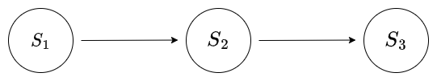
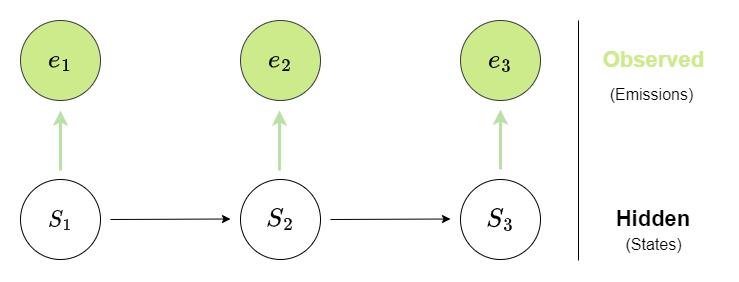

<!-- 

$$ \delta_j = \underset{k}{\operatorname{max}} {P (path_k({t}_j^s))} $$




$$
\gamma_{n} = \frac{ \left | \left (\mathbf x_{n} - \mathbf x_{n-1} \right )^T \left [\nabla F (\mathbf x_{n}) - \nabla F (\mathbf x_{n-1}) \right ] \right |}{\left \|\nabla F(\mathbf{x}_{n}) - \nabla F(\mathbf{x}_{n-1}) \right \|^2}
$$
 -->

## Markov Model vs Hidden Markov Model

* ***Markov Model***: The system transitions between states with some *transition probabilities* and the states are what we observe.

* ***Hidden Markov Model***: The system transitions between states with some transition probabilities, but the states themselves are invisible . . . instead we can only observe the a sequence of emissions, and have to infer the underlying state which generated the emission.

## Main task

***Given a sequence of observations viz. observed emissions, the task is to extract the most likely sequence of underlying states.***

## Why it is challenging

***Naive method***:  

Suppose there are  $n$ states (where we saw the corresponding $n$ emissions) and each state $t$ has $g_t$ different possible emissions.  

Then for an observed sequence of length n, there are $\prod_{1}^{n} g_t$ possible state sequences which could explain the observed emission sequence.  

**The naive method would be:** 

* Enumerating over all possible sequences, 
* Calculating the probability of each and every possible sequence, and 
* Comparing all of these to get the state with the highest probability.

But this is not efficient, and just not feasible for longer sequences.

## Relevant Algorithms

Two algorithms are relevant:

* ***Viterbi Decoding Algorithm***: Efficiently infer the underlying sequence with the highest probability, when the transition probability matrix is known. 

* ***Baum-Welch algorithm***: Also called the "Forward-Backward Algorithm", this can be used for estimating the transition probability matrix from just the data. (Then, once the transition probability matrix is known, we can use the Viterbi Decoding Algorithm.)

We will first look at Viterbi Decoding.
